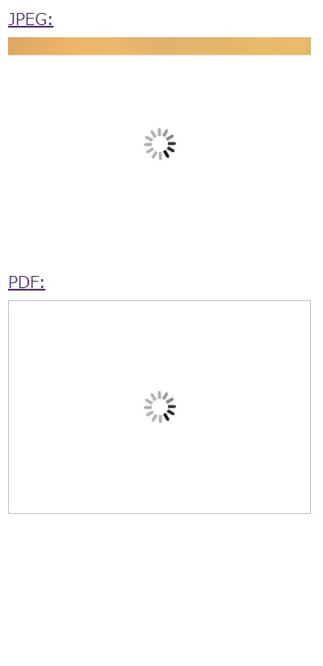
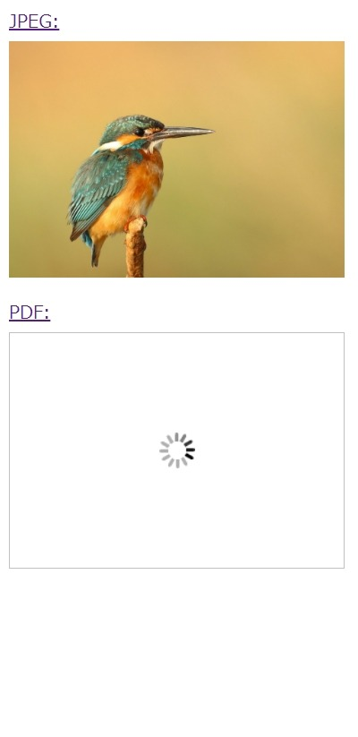
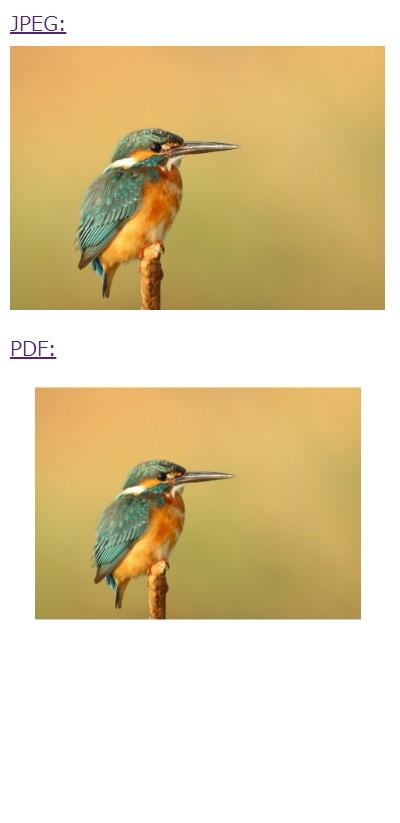

# pdf-lazyload-sample
Sample of PDF lazy load using lazysizes.

## Demo
Click [here](https://takuya-motoshima.github.io/pdf-lazyload-sample/).

<p align="center">
  
  
  
</p>


## Sample code
Requires installation of [lazysizes](https://www.npmjs.com/package/lazysizes) and [pdfjs-dist](https://www.npmjs.com/package/pdfjs-dist).
```sh
npm i lazysizes
npm i pdfjs-dist
```

HTML:
```html
<!DOCTYPE html>
<html lang="en">
<head>
  <meta charset="UTF-8">
  <meta name="viewport" content="width=device-width, initial-scale=1.0">
  <title>PDF lazy load sample</title>
  <link rel="stylesheet" href="style.css">
</head>
<body>
  <div class="image-container">
    <a href="images/sample.jpg" target="_blank" class="image-title">JPEG:</a>
    
  </div>
  <div class="image-container">
    <a href="images/sample.pdf" target="_blank" class="image-title">PDF:</a>
    
  </div>
  <script type="module" src="script.js"></script>
</body>
</html>
```

CSS:
```css
.image-container {
  display: flex;
  flex-direction: column;
  margin-bottom: 20px;
}

  .image-title {
    margin-bottom: 5px;
  }

  img {
    width: 300px;
    height: auto;
    min-height: 32px;
    max-width: 100%;
  }

  .lazyloading, .loading {
    background: url(images/loader.gif) no-repeat center;
    overflow: visible;
  }
```


JS:
```js
import * as pdfjsLib from './node_modules/pdfjs-dist/build/pdf.mjs'
import './node_modules/lazysizes/lazysizes.min.js';

/**
  * Get PDF data URL.
  * @param {string} source PDF data URL or path.
  * @return {Promise<string>} Image data URL.
  */
const pdf2image = async source => {
  // Setting worker path to worker bundle.
  if (!pdfjsLib.GlobalWorkerOptions.workerSrc)
    pdfjsLib.GlobalWorkerOptions.workerSrc = 'node_modules/pdfjs-dist/build/pdf.worker.mjs';

  // Loading a document.
  const loadingTask = pdfjsLib.getDocument(source);
  const pdfDocument = await loadingTask.promise;

  // Request a first page.
  const pdfPage = await pdfDocument.getPage(1);

  // Draw PDF with 100% scaling on canvas.
  const viewport = pdfPage.getViewport({scale: 1.0});
  const canvas = document.createElement('canvas');
  canvas.width = viewport.width;
  canvas.height = viewport.height;
  const renderTask = pdfPage.render({canvasContext: canvas.getContext('2d'), viewport});
  await renderTask.promise;

  // Returns the PDF drawn on the canvas as an image data URL.
  return canvas.toDataURL('image/jpeg', 1.);
}

// Execute after lazysizes is loaded.
document.addEventListener('lazybeforeunveil', async event => {
  // Check if the target element is a PDF.
  if (event.target.dataset.src.endsWith('.pdf')) {
    // Prevent default image loading behavior.
    event.preventDefault();

    // Add loading indicator.
    event.target.classList.add('loading');

    // Load the PDF using PDF.js
    pdf2image(event.target.dataset.src).then(pdf => {
      // Render the PDF.
      event.target.src = pdf;

      // Notify lazysizes that loading is complete.
      event.target.classList.add('lazyloaded');

      // Remove loading indicator.
      event.target.classList.remove('loading');
    });
  }
});
```

## License
[MIT](LICENSE)